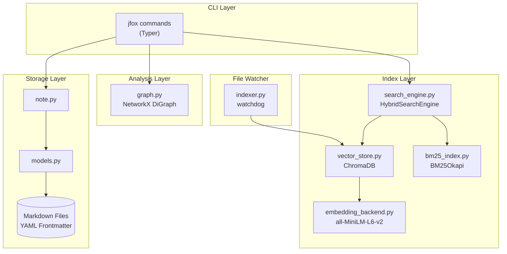
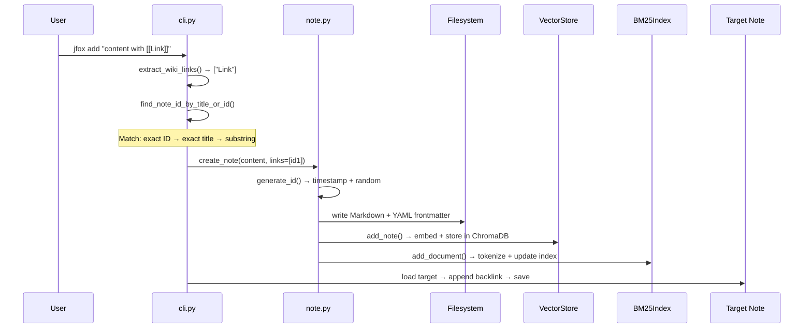
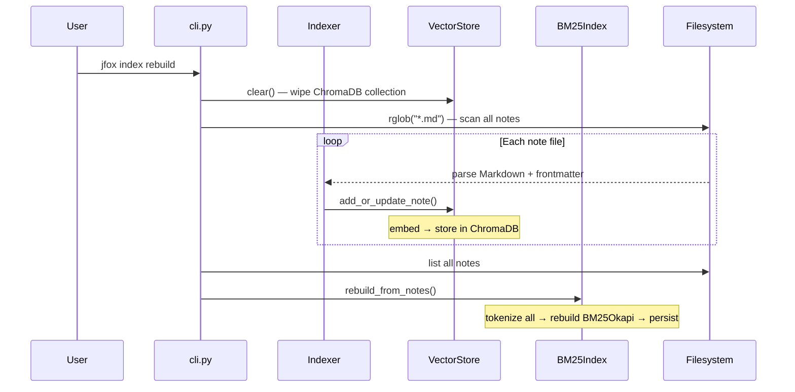
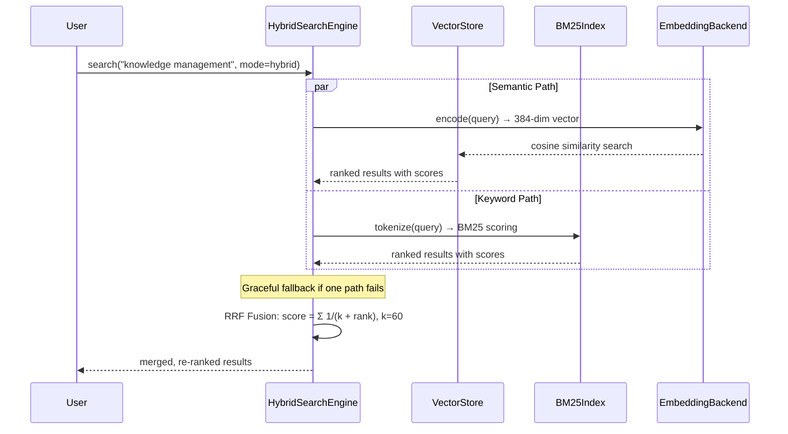
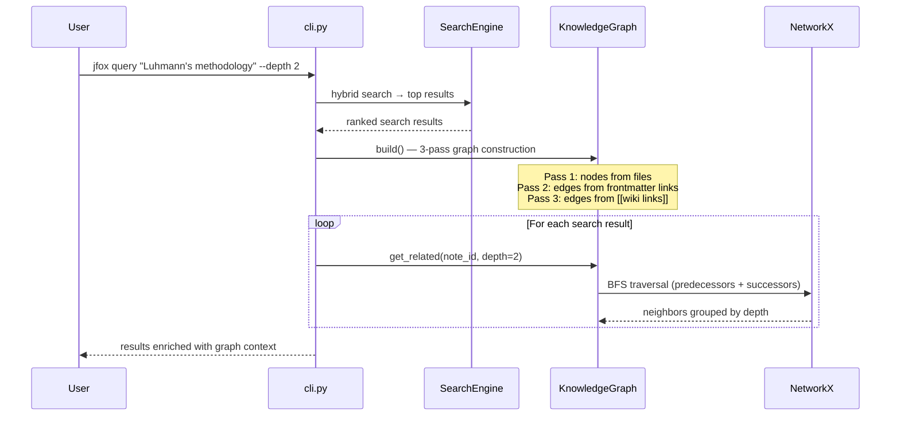

# JFox

[](LICENSE)
[](pyproject.toml)
[](#)

> A local-first Zettelkasten knowledge management CLI.
> Bidirectional links, semantic search, knowledge graphs — all offline, all on CPU.

**JFox** (**J** + **Fox** / "box") is a command-line tool that helps you build a personal knowledge base using the [Zettelkasten method](https://en.wikipedia.org/wiki/Zettelkasten). Notes live as plain Markdown files on your disk, connected by `[[wiki links]]` and indexed for instant semantic search.

---

## Table of Contents

- [Features](#features)
- [Architecture](#architecture)
- [Data Flows](#data-flows)
- [Quick Start](#quick-start)
- [Command Reference](#command-reference)
- [Note Format](#note-format)
- [Contributing](#contributing)
- [License](#license)

---

## Features

- **Three note types** — Fleeting (quick capture), Literature (reading notes), Permanent (refined knowledge)
- **Bidirectional links** — Write `[[Note Title]]` to connect notes; backlinks are auto-generated
- **Hybrid search** — BM25 keyword search + semantic vector search, fused with Reciprocal Rank Fusion
- **Knowledge graph** — NetworkX-powered link analysis: clusters, orphans, hubs, shortest paths
- **File watcher** — Real-time index updates when you edit notes with any editor
- **Multi knowledge bases** — Manage separate KBs for work, personal, research, etc.

---

## Architecture

### Three-Layer Design



### Module Map

| Module | Role |
|--------|------|
| `cli.py` | All CLI commands (~2400 lines). Each command delegates to a `_xxx_impl()` helper |
| `config.py` | Per-KB config (`ZKConfig`) + `use_kb()` context manager for KB switching |
| `global_config.py` | Multi-KB registry in `~/.zk_config.json` |
| `kb_manager.py` | KB lifecycle: create, rename, remove, switch |
| `note.py` | CRUD on Markdown files with dual-index updates |
| `models.py` | `Note` dataclass with YAML frontmatter serialization |
| `search_engine.py` | `HybridSearchEngine` — dispatches to semantic/keyword/hybrid with RRF fusion |
| `vector_store.py` | ChromaDB wrapper with cosine similarity search |
| `bm25_index.py` | BM25 keyword index with Chinese/English tokenizer |
| `embedding_backend.py` | Lazy-loaded SentenceTransformer (`all-MiniLM-L6-v2`, 384-dim vectors) |
| `graph.py` | NetworkX DiGraph built from links + wiki links; BFS, clusters, hubs |
| `indexer.py` | File watcher (watchdog) with debounce for incremental ChromaDB updates |
| `formatters.py` | Output in JSON, CSV, YAML, Table, Paths, Tree formats |
| `performance.py` | Batch processing, model caching, bulk import pipeline |

---

## Data Flows

### Note Creation

When you run `jfox add`, the system parses wiki links, creates the Markdown file, updates both indexes, and propagates backlinks:



### Index Rebuild

`jfox index rebuild` reconstructs both the vector index and the keyword index from all Markdown files on disk:



### Hybrid Search (BM25 + Semantic → RRF)

`jfox search` runs two independent search paths in parallel and fuses results using Reciprocal Rank Fusion:



### Query with Graph Traversal

`jfox query` combines hybrid search with knowledge graph BFS to find semantically related notes and their neighbors:



---

## Quick Start

### Install

```bash
# Recommended
uv tool install "git+https://github.com/zhuxixi/jfox.git"

# Or with pip
pip install -e ".[dev]"
```

See [Installation Guide](docs/installation.md) for details, Windows PATH setup, and uninstall instructions.

### Create Your First Note

```bash
jfox init
jfox add "The Zettelkasten method uses atomic notes connected by links" \
    --title "Zettelkasten Introduction" --type permanent
```

### Add Links

```bash
jfox add "[[Zettelkasten Introduction]] was invented by Niklas Luhmann" \
    --title "Luhmann and the Card Box" --type permanent
```

The `[[Zettelkasten Introduction]]` syntax automatically creates a bidirectional link. Backlinks are propagated to the target note.

### Search

```bash
# Semantic + keyword hybrid search
jfox search "knowledge management method"

# Hybrid search + graph traversal
jfox query "Luhmann's methodology" --depth 2
```

---

## Command Reference

### Knowledge Base

| Command | Description |
|---------|-------------|
| `jfox init` | Initialize a knowledge base |
| `jfox init --name work --desc "Work notes"` | Initialize a named KB |
| `jfox kb list` | List all knowledge bases |
| `jfox kb use work` | Switch default KB |
| `jfox kb info work` | Show KB details and stats |
| `jfox kb rename old new` | Rename a KB |
| `jfox kb remove name --force` | Delete a KB and its data |

### Notes

| Command | Description |
|---------|-------------|
| `jfox add "content" --title "Title" --type permanent` | Create a note |
| `jfox add --content-file note.txt --title "Title"` | Create from file content |
| `jfox list` | List all notes |
| `jfox list --type permanent --limit 20` | Filter by type |
| `jfox status` | Show knowledge base status |
| `jfox edit NOTE_ID` | Edit note in `$EDITOR` |
| `jfox delete NOTE_ID --force` | Delete a note |
| `jfox daily` | Show today's notes |
| `jfox daily --date 2026-03-20` | Show notes for a date |
| `jfox inbox` | Show fleeting notes |
| `jfox suggest-links "content"` | Suggest notes to link from content |
| `jfox bulk-import notes.json` | Bulk import from JSON (optimized) |
| `jfox ingest-log` | Import git commit history as notes |

### Search & Analysis

| Command | Description |
|---------|-------------|
| `jfox search "query"` | Hybrid search (default) |
| `jfox search "query" --mode semantic` | Semantic search only |
| `jfox search "query" --mode keyword` | BM25 keyword search only |
| `jfox query "concept" --depth 2` | Search + graph traversal |
| `jfox refs` | Show link statistics for all notes |
| `jfox refs --search "keyword"` | Filter refs by title |
| `jfox refs --note NOTE_ID` | Show links for a specific note |
| `jfox graph --stats` | Graph statistics |
| `jfox graph --orphans` | Find isolated notes |
| `jfox graph --note NOTE_ID --depth 2` | Subgraph around a note |

### Index Management

| Command | Description |
|---------|-------------|
| `jfox index status` | Show index health |
| `jfox index rebuild` | Rebuild vector + BM25 indexes |
| `jfox index verify` | Cross-check files vs indexed entries |

### Templates

| Command | Description |
|---------|-------------|
| `jfox template list` | List built-in and custom templates |
| `jfox template show quick` | Display template content |
| `jfox template create my-template` | Create a custom template |
| `jfox template edit my-template` | Edit in `$EDITOR` |
| `jfox template remove my-template` | Delete a custom template |

### Performance & Debug

| Command | Description |
|---------|-------------|
| `jfox perf report` | Show performance metrics |
| `jfox perf clear-cache` | Clear embedding model cache |

### Global Options

| Option | Description |
|--------|-------------|
| `--kb NAME` | Target a specific knowledge base |
| `--format json\|table\|csv\|yaml\|paths\|tree` | Output format |
| `--json` | Shortcut for `--format json` |
| `--version` | Show version |

---

## Note Format

### Directory Structure

```
~/.zettelkasten/
├── default/                # Default knowledge base
│   ├── notes/
│   │   ├── fleeting/       # Quick captures
│   │   ├── literature/     # Reading notes
│   │   └── permanent/      # Refined knowledge
│   └── .zk/
│       ├── chroma_db/      # Vector index
│       ├── bm25_index.pkl  # Keyword index
│       ├── templates/      # Jinja2 templates
│       └── config.yaml     # KB config
├── work/                   # Named KB example
│   ├── notes/
│   └── .zk/
└── ~/.zk_config.json       # Global KB registry
```

### File Format

Each note is a Markdown file with YAML frontmatter:

```markdown
---
id: '20260321011528'
title: Machine Learning Overview
type: permanent
created: '2026-03-21T01:15:28'
updated: '2026-03-21T01:15:28'
tags:
- ml
- ai
links:
- 20260321011546
backlinks:
- 20260321011550
---

# Machine Learning Overview

[[Deep Learning]] is a subfield of machine learning...
```

### Note Types

| Type | Purpose | Filename |
|------|---------|----------|
| `fleeting` | Quick ideas, temporary captures | `YYYYMMDD-HHMMSSNNNN.md` |
| `literature` | Reading notes, paper summaries | `YYYYMMDDHHMMSSNNNN-slug.md` |
| `permanent` | Refined, lasting knowledge | `YYYYMMDDHHMMSSNNNN-slug.md` |

### Link Resolution

`[[Link Text]]` matches notes by priority:

1. **Exact ID** — if text matches a note ID
2. **Exact title** — case-insensitive title match
3. **Substring** — title contains the link text

---

## Contributing

```bash
git clone https://github.com/zhuxixi/jfox.git
cd jfox
uv sync --extra dev
uv run pytest tests/ -v
```

See [Troubleshooting](docs/troubleshooting.md) for common issues.

## License

[MIT](LICENSE)

## Acknowledgments

- [sentence-transformers](https://www.sbert.net/) — text embeddings
- [ChromaDB](https://www.trychroma.com/) — vector database
- [NetworkX](https://networkx.org/) — graph algorithms
- [Typer](https://typer.tiangolo.com/) — CLI framework
- [Rich](https://rich.readthedocs.io/) — terminal formatting
