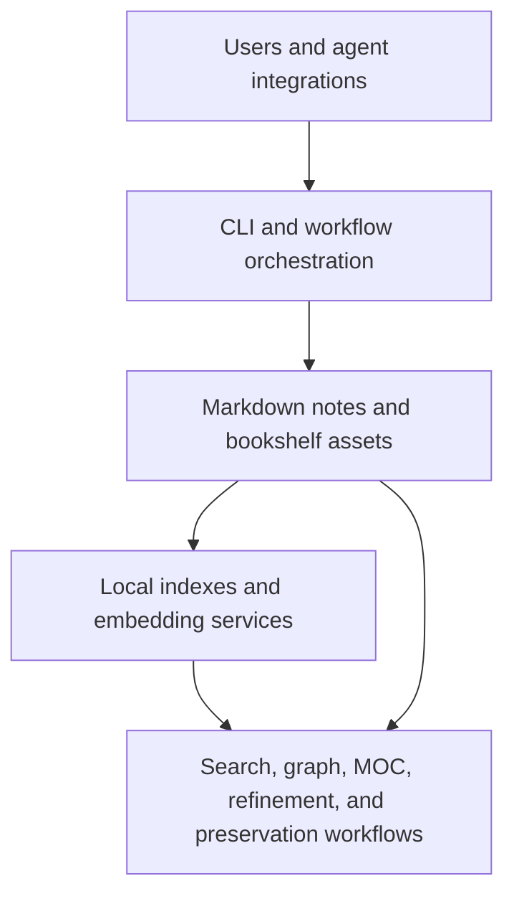

# JFox

[](https://github.com/zhuxixi/jfox/actions/workflows/integration-test.yml)

[](pyproject.toml)


> A local-first Zettelkasten knowledge management CLI.

JFox keeps your knowledge in plain Markdown files, connects notes with `[[wiki links]]`, and makes the resulting knowledge base searchable and navigable through local indexes and graph analysis.

## Table of Contents

- [What Is JFox?](#what-is-jfox)
- [Features](#features)
- [Quick Start](#quick-start)
- [Core Workflows](#core-workflows)
- [Note Model](#note-model)
- [Common Commands](#common-commands)
- [Architecture](#architecture)
- [Agent Integrations](#agent-integrations)
- [Installation and Development](#installation-and-development)
- [Privacy](#privacy)
- [License and Acknowledgments](#license-and-acknowledgments)

## What Is JFox?

JFox applies the [Zettelkasten method](https://en.wikipedia.org/wiki/Zettelkasten) to a local knowledge base. Your notes remain ordinary Markdown files with YAML frontmatter, so you can inspect, edit, back up, and move them with standard file-system tools.

Use `[[wiki links]]` to connect ideas. JFox resolves those links, maintains backlinks, and builds local indexes that support both exact-term and meaning-based retrieval. Knowledge graph and Map of Content (MOC) features help you navigate relationships instead of treating every note as an isolated document.

JFox is designed to keep its core knowledge-management workflow local rather than turning your notes into a hosted service. Optional integrations that communicate with external services are described separately in [Privacy](#privacy).

## Features

- **Markdown-first notes** — Store knowledge as portable Markdown files instead of an opaque database.
- **Distinct note types** — Capture quick ideas, reading notes, refined knowledge, agent sessions, reviewable candidates, and structure notes.
- **Bidirectional links** — Write `[[Note Title]]` once and let JFox maintain the corresponding backlinks.
- **Hybrid search** — Combine keyword matching with semantic search to find both exact terms and related ideas.
- **Knowledge graph navigation** — Inspect references, find orphans and hubs, traverse related notes, and understand the shape of your knowledge base.
- **MOCs and structure notes** — Organize dense topic clusters into navigable Maps of Content.
- **Knowledge refinement** — Turn captured session fragments into synthesized candidate gems for human review.
- **Local bookshelf assets** — Keep PDFs, extracted bundles, and book metadata together without mixing them into the note index.
- **Multiple knowledge bases** — Separate work, personal, research, or project knowledge while keeping the same CLI.
- **Operational safeguards** — Use an embedding daemon, rolling backups, archive/unarchive, and optional Claude Code session auto-summary when you need them.

## Quick Start

The shortest useful workflow is:

```text
install → initialize → create a note → create a link → search
```

### Install

For a quick user installation with `uv`:

```bash
uv tool install "git+https://github.com/zhuxixi/jfox.git"
```

For local development, see [Installation and Development](#installation-and-development).

### Initialize a knowledge base

```bash
jfox init
```

### Create connected notes

```bash
jfox add "Atomic notes become useful when they are connected." \
  --title "Connected Notes" --type permanent

jfox add "See [[Connected Notes]] for the starting principle." \
  --title "A Linked Note" --type permanent
```

The `[[Connected Notes]]` reference connects the second note to the first. JFox resolves the link and updates the target's backlinks.

### Search your notes

```bash
jfox search "connected notes"
```

The default search combines keyword and semantic retrieval. Use [Common Commands](#common-commands) to find the commands for graph exploration, note organization, and advanced workflows.

## Core Workflows

### Capture and connect notes

Start with a note type that matches the maturity of the material:

- A `fleeting` note is a quick capture that may need further processing.
- A `literature` note records ideas from a book, paper, or other source.
- A `permanent` note expresses refined knowledge intended to remain useful.

Connect notes with `[[Note Title]]` references rather than copying context between files. JFox resolves each reference by note ID or title and maintains the corresponding backlink, so the connection can be followed in both directions.

**Duplicate protection.** Before saving a `permanent` note, `jfox add` runs a duplicate gate with two channels: an exact title match against non-archived notes, and a body-similarity check (cosine >= 0.95, configurable via the global `note_add.dedup_threshold`) that runs only while the embedding daemon is up. On a hit the note is not saved: JSON output reports `{"success": false, "skipped": "duplicate", ...}` and the exit code is 1. Pass `--force` to bypass the gate (backfills or intentional duplicates). Seed the similarity channel for existing notes with `jfox gem-synth dedup-backfill`.

### Search and navigate knowledge

Keyword search is useful when you know the exact words you want. Semantic search uses embeddings to find notes with related meaning even when the wording differs. Hybrid search combines both paths for a broader retrieval workflow.

Use graph commands when the connection itself matters. Inspect references with `jfox refs`, view graph statistics with `jfox graph --stats`, explore a note's neighborhood with `jfox graph --note NOTE_ID --depth 2`, or combine search with graph traversal through `jfox query`.

For dense topic clusters, a structure note acts as a Map of Content: it gives a human-readable entry point into related permanent notes without replacing those notes.

### Refine knowledge with the gem pipeline

JFox can support an assisted refinement path for material captured from AI-agent sessions:

```text
session fragments
    → gem synthesis
    → candidate notes
    → human review
    → permanent notes
```

Session fragments are raw captures, not trusted knowledge. Gem synthesis produces a `candidate` note that can be inspected, promoted, or rejected. The current L3 synthesis output uses the `flawed` gem level. Promotion to `permanent` is a review decision; it is not an automatic guarantee that generated content is correct.

The main command groups for this workflow are:

```bash
jfox fragments list
jfox candidates list
jfox gem-synth status
```

### Organize and preserve knowledge

Use `jfox archive` and `jfox unarchive` when a note should leave or return to the active workflow without being permanently deleted. Use multiple knowledge bases to keep unrelated contexts separate.

The backup system can create, verify, and restore rolling snapshots of your knowledge-base data. Use `jfox backup restore SNAPSHOT` to restore a knowledge-base state from a snapshot. The embedding daemon keeps the local model available between commands, while optional auto-summary can turn finished Claude Code sessions into `session` notes.

These operational features are opt-in or explicit actions. Review [Privacy](#privacy) before enabling auto-summary, and review [Installation and Development](#installation-and-development) for troubleshooting and model-download details.

### Manage books as local assets

The bookshelf keeps a book's original file, extracted bundle, and JFox metadata together as local assets:

```bash
jfox bookshelf add BOOK_FOLDER
jfox bookshelf list
jfox bookshelf show BOOK_SLUG
```

Bookshelf assets are intentionally separate from the note index. Adding a book to the shelf does not automatically make its pages searchable through `jfox search`.

## Note Model

Every note has a type that describes its role in the knowledge workflow.

| Value | Meaning |
|---|---|
| `fleeting` | A quick capture or temporary idea. |
| `literature` | Notes derived from reading or source material. |
| `permanent` | Refined knowledge intended to remain useful. |
| `session` | A record of an AI-agent session. |
| `candidate` | A synthesized proposal awaiting human review. |
| `structure` | A Map of Content (MOC) used to organize related notes. |

Candidate notes can also carry a knowledge-gem level:

```text
chipped → flawed → normal → flawless → perfect
```

The levels describe increasing maturity:

- `chipped` represents raw fragments and is not a note-file state.
- `flawed` is the current L3 candidate output.
- `normal`, `flawless`, and `perfect` represent progressively more mature knowledge.
- Promotion to `permanent` remains a human review decision.

### File format

Notes are Markdown files with YAML frontmatter followed by a generated title heading and the note body:

```markdown
---
id: '20260321011528'
title: Connected Notes
type: permanent
created: '2026-03-21T01:15:28'
updated: '2026-03-21T01:15:28'
tags:
  - knowledge-management
links:
  - '20260321011546'
backlinks:
  - '20260321011550'
---

# Connected Notes

Atomic notes become useful when they are connected.
```

Use standard Markdown editors to work with note files. JFox maintains the indexes and relationship metadata around those files.

## Common Commands

This is a curated overview, not an exhaustive command reference. Use it to find the main entry points by task:

| Task | Commands |
|---|---|
| Initialize and manage knowledge bases | `jfox init`, `jfox kb list`, `jfox kb info`, `jfox config` |
| Create and inspect notes | `jfox add`, `jfox list`, `jfox show`, `jfox edit` |
| Organize note lifecycle | `jfox archive`, `jfox unarchive`, `jfox delete`, `jfox redirect` |
| Search and navigate | `jfox search`, `jfox query`, `jfox refs`, `jfox graph`, `jfox moc` |
| Capture and review refinement | `jfox fragments`, `jfox candidates`, `jfox gem-synth` |
| Manage books and indexes | `jfox bookshelf`, `jfox index` |
| Run local services and safeguards | `jfox daemon`, `jfox backup`, `jfox auto-summary` |
| Maintain the installation | `jfox model`, `jfox check`, `jfox update` |

For the complete current command and option list, run:

```bash
jfox --help
jfox <command> --help
```

For the complete command and option reference, see the [CLI Reference](docs/cli-reference.md). You can also run `jfox --help` or `jfox <command> --help` for the installed CLI's runtime help. The README intentionally keeps only stable, representative examples; command existence and option details are defined by the installed CLI.

## Architecture

JFox keeps its core workflow local and separates durable storage from derived indexes and higher-level workflows:


```mermaid
graph TD
    U[Users and agent integrations]
    C[CLI and workflow orchestration]
    S[Markdown notes and bookshelf assets]
    I[Local indexes and embedding services]
    W[Search, graph, MOC, refinement, and preservation workflows]

    U --> C
    C --> S
    S --> I
    I --> W
    S --> W
```

- **Durable storage** contains Markdown notes, YAML frontmatter, and bookshelf assets.
- **Derived services** maintain keyword indexes, vector indexes, and optional embedding-daemon state.
- **Knowledge workflows** build on those layers for search, graph navigation, MOCs, candidate refinement, backups, and integrations.

The architecture description is intentionally conceptual. The complete implementation module map belongs in developer documentation rather than in this user-facing README.

## Agent Integrations

JFox can be used directly from the CLI or through agent-specific integrations:

- **Claude Code** — The plugin in [`packages/cc-plugin/`](packages/cc-plugin/) provides knowledge-base management, search, ingest, organization, promotion, and session-related workflows.
- **Kimi Code** — The maintained plugin package in [`packages/kimi-plugin/`](packages/kimi-plugin/) provides Kimi-compatible JFox skills and installation instructions.
- **pi coding agent** — Recommended Agent Skills are available under [`skills-recommend/pi/`](skills-recommend/pi/) for knowledge-base management, search, organization, bookshelf operations, CI, and release workflows.

The integration packages are adapters around the JFox CLI. Their installation and supported capabilities can evolve independently from the core command-line application.

## Installation and Development

### Requirements

- Python 3.10 or later.
- `uv` is recommended for installation and development.
- The embedding model is downloaded on first use when it is not already cached.

### Install for development

```bash
git clone https://github.com/zhuxixi/jfox.git
cd jfox
uv sync --extra dev
```

Verify the installation:

```bash
uv run jfox --help
uv run jfox --version
```

For upgrade, uninstall, Windows PATH setup, and Hugging Face mirrors, see [docs/installation.md](docs/installation.md). For model-download and other runtime issues, see [docs/troubleshooting.md](docs/troubleshooting.md). For pip-based development installation, see the [legacy pip instructions](docs/installation.md#legacy-pip).

### Run checks

The fast test suite skips embedding and slow tests:

```bash
uv run pytest tests/ -m "not embedding and not slow"
```

The repository also uses the following checks for code and documentation changes:

```bash
uv run ruff check jfox/ tests/
uv run black --check jfox/ tests/
npx --yes markdownlint-cli2 "**/*.md" "#node_modules" "#.venv"
```

The CLI reference at [docs/cli-reference.md](docs/cli-reference.md) is generated
from the live Typer command tree and `docs/cli-descriptions.yaml`. After
changing CLI commands or command descriptions, regenerate it and commit the
result:

```bash
uv run python scripts/generate_docs.py
```

CI fails when the committed reference is stale.

## Privacy

JFox is local-first, but not every optional integration is offline:

- Notes, indexes, and core note, search, and graph operations run locally by default.
- The embedding model may need to be downloaded the first time it is used. After that, it can be reused from the local cache.
- The optional auto-summary feature invokes `claude -p` to summarize finished Claude Code sessions.
- Auto-summary sends the selected session text to Anthropic through the Claude Code CLI. Enable it only when that data flow is acceptable to you.

You control which optional services to enable. Services that support knowledge-base selection expose their own target-knowledge-base settings.

## License and Acknowledgments

JFox is released under the MIT License.

JFox builds on:

- [Typer](https://typer.tiangolo.com/) for the CLI framework.
- [Rich](https://rich.readthedocs.io/) for terminal output.
- [sentence-transformers](https://www.sbert.net/) for text embeddings.
- [ChromaDB](https://www.trychroma.com/) for vector storage.
- [NetworkX](https://networkx.org/) for graph algorithms.
