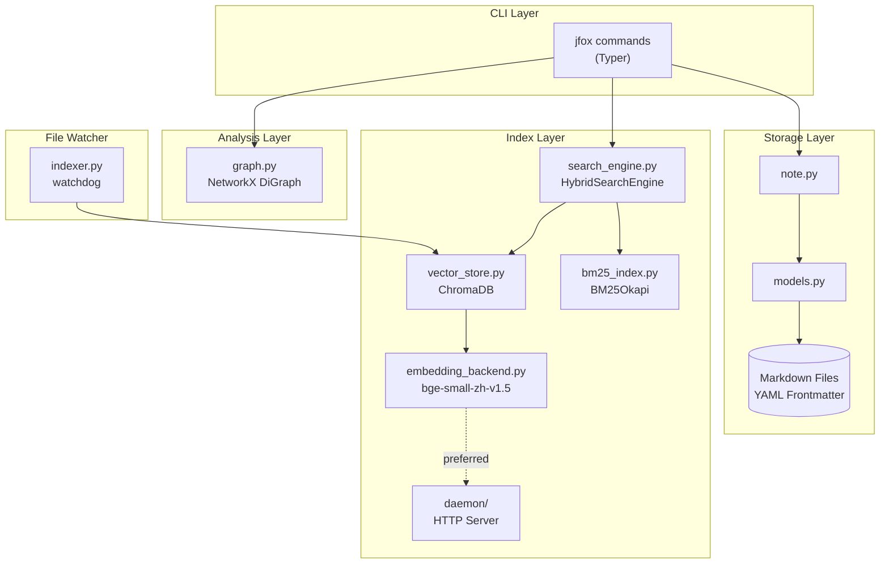
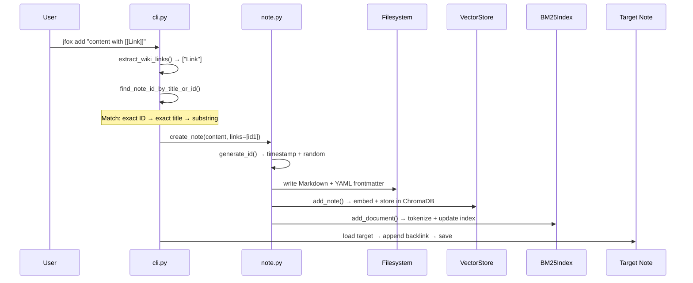
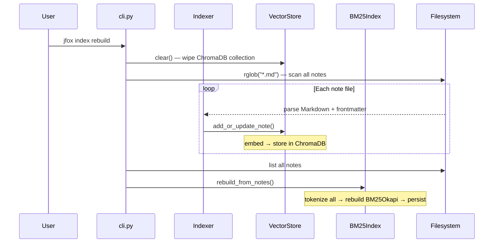
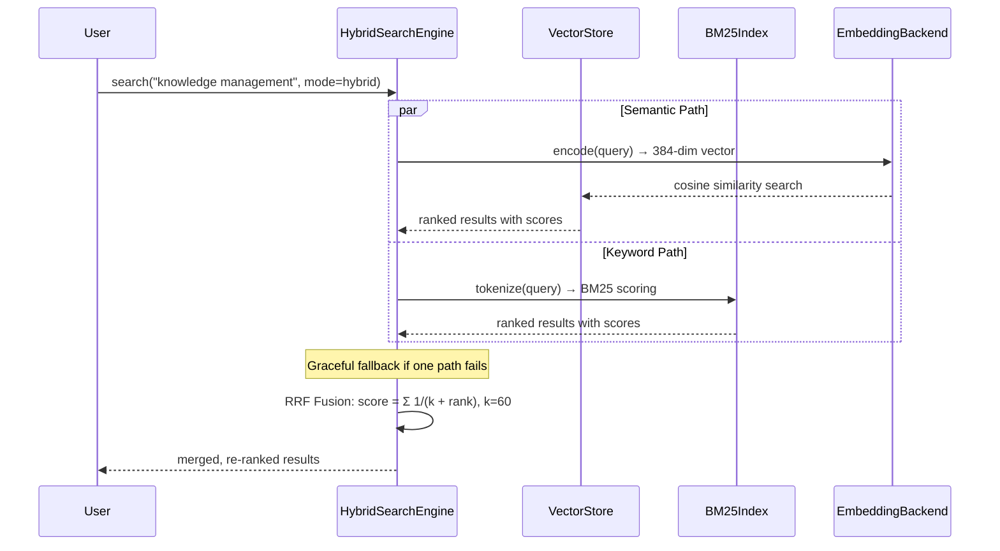
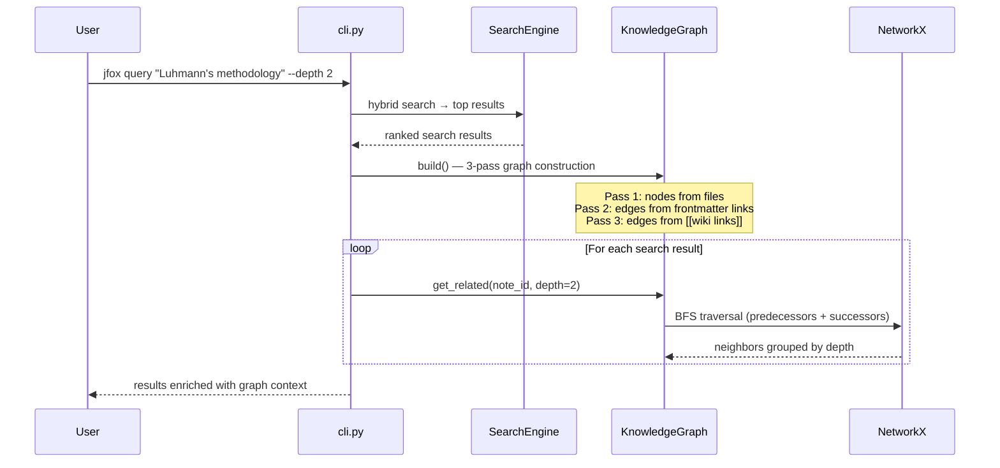

# JFox

[](LICENSE)
[](pyproject.toml)


> A local-first Zettelkasten knowledge management CLI.
> Bidirectional links, semantic search, knowledge graphs — all offline, all on CPU.

**JFox** (**J** + **Fox** / "box") is a command-line tool that helps you build a personal knowledge base using the [Zettelkasten method](https://en.wikipedia.org/wiki/Zettelkasten). Notes live as plain Markdown files on your disk, connected by `[[wiki links]]` and indexed for instant semantic search.

---

## Table of Contents

- [Features](#features)
- [Architecture](#architecture)
- [Data Flows](#data-flows)
- [Quick Start](#quick-start)
- [Command Reference](#command-reference)
- [Note Format](#note-format)
- [Contributing](#contributing)
- [License](#license)

---

## Features

- **Three note types** — Fleeting (quick capture), Literature (reading notes), Permanent (refined knowledge)
- **Bidirectional links** — Write `[[Note Title]]` to connect notes; backlinks are auto-generated
- **Hybrid search** — BM25 keyword search + semantic vector search, fused with Reciprocal Rank Fusion
- **Knowledge graph** — NetworkX-powered link analysis: clusters, orphans, hubs, shortest paths
- **File watcher** — Real-time index updates when you edit notes with any editor
- **Multi knowledge bases** — Manage separate KBs for work, personal, research, etc.

---

## Architecture

### Three-Layer Design


```mermaid
graph TB
    subgraph CLI ["CLI Layer"]
        cmd["jfox commands<br/>(Typer)"]
    end
    subgraph Storage ["Storage Layer"]
        note[note.py]
        models[models.py]
        md[("Markdown Files<br/>YAML Frontmatter")]
    end
    subgraph Index ["Index Layer"]
        se[search_engine.py<br/>HybridSearchEngine]
        vs[vector_store.py<br/>ChromaDB]
        bm[bm25_index.py<br/>BM25Okapi]
        emb[embedding_backend.py<br/>bge-small-zh-v1.5]
        daemon["daemon/<br/>HTTP Server"]
    end
    subgraph Analysis ["Analysis Layer"]
        gph["graph.py<br/>NetworkX DiGraph"]
    end
    subgraph Watcher ["File Watcher"]
        idx[indexer.py<br/>watchdog]
    end

    cmd --> note & se & gph
    note --> models --> md
    se --> vs & bm
    vs --> emb
    emb -.->|"preferred"| daemon
    idx --> vs
```

### Module Map

| Module | Role |
|--------|------|
| `cli.py` | All CLI commands (~2500 lines). Each command delegates to a `_xxx_impl()` helper |
| `config.py` | Per-KB config (`ZKConfig`) + `use_kb()` context manager for KB switching |
| `global_config.py` | Multi-KB registry in `~/.zk_config.json` |
| `kb_manager.py` | KB lifecycle: create, rename, remove, switch |
| `note.py` | CRUD on Markdown files with dual-index updates |
| `models.py` | `Note` dataclass with YAML frontmatter serialization |
| `search_engine.py` | `HybridSearchEngine` — dispatches to semantic/keyword/hybrid with RRF fusion |
| `vector_store.py` | ChromaDB wrapper with cosine similarity search |
| `bm25_index.py` | BM25 keyword index with Chinese/English tokenizer |
| `embedding_backend.py` | Lazy-loaded SentenceTransformer (`BAAI/bge-small-zh-v1.5`, 512-dim vectors; GPU auto-switches to bge-m3) |
| `daemon/` | Embedding HTTP 守护进程，常驻模型避免重复加载 |
| `graph.py` | NetworkX DiGraph built from links + wiki links; BFS, clusters, hubs |
| `indexer.py` | File watcher (watchdog) with debounce for incremental ChromaDB updates |
| `formatters.py` | Output in JSON, CSV, YAML, Table, Paths, Tree formats |
| `performance.py` | Batch processing, model caching, bulk import pipeline |

---

## Data Flows

### Note Creation

When you run `jfox add`, the system parses wiki links, creates the Markdown file, updates both indexes, and propagates backlinks:


```mermaid
sequenceDiagram
    participant U as User
    participant CLI as cli.py
    participant NM as note.py
    participant MD as Filesystem
    participant VS as VectorStore
    participant BM as BM25Index
    participant T as Target Note

    U->>CLI: jfox add "content with [[Link]]"
    CLI->>CLI: extract_wiki_links() → ["Link"]
    CLI->>CLI: find_note_id_by_title_or_id()
    Note over CLI: Match: exact ID → exact title → substring
    CLI->>NM: create_note(content, links=[id1])
    NM->>NM: generate_id() → timestamp + random
    NM->>MD: write Markdown + YAML frontmatter
    NM->>VS: add_note() → embed + store in ChromaDB
    NM->>BM: add_document() → tokenize + update index
    CLI->>T: load target → append backlink → save
```

### Index Rebuild

`jfox index rebuild` reconstructs both the vector index and the keyword index from all Markdown files on disk:


```mermaid
sequenceDiagram
    participant U as User
    participant CLI as cli.py
    participant IDX as Indexer
    participant VS as VectorStore
    participant BM as BM25Index
    participant FS as Filesystem

    U->>CLI: jfox index rebuild
    CLI->>VS: clear() — wipe ChromaDB collection
    CLI->>FS: rglob("*.md") — scan all notes
    loop Each note file
        FS-->>IDX: parse Markdown + frontmatter
        IDX->>VS: add_or_update_note()
        Note over VS: embed → store in ChromaDB
    end
    CLI->>FS: list all notes
    CLI->>BM: rebuild_from_notes()
    Note over BM: tokenize all → rebuild BM25Okapi → persist
```

### Hybrid Search (BM25 + Semantic → RRF)

`jfox search` runs two independent search paths in parallel and fuses results using Reciprocal Rank Fusion:


```mermaid
sequenceDiagram
    participant U as User
    participant SE as HybridSearchEngine
    participant VS as VectorStore
    participant BM as BM25Index
    participant EMB as EmbeddingBackend

    U->>SE: search("knowledge management", mode=hybrid)
    par Semantic Path
        SE->>EMB: encode(query) → 384-dim vector
        EMB-->>VS: cosine similarity search
        VS-->>SE: ranked results with scores
    and Keyword Path
        SE->>BM: tokenize(query) → BM25 scoring
        BM-->>SE: ranked results with scores
    end
    Note over SE: Graceful fallback if one path fails
    SE->>SE: RRF Fusion: score = Σ 1/(k + rank), k=60
    SE-->>U: merged, re-ranked results
```

### Query with Graph Traversal

`jfox query` combines hybrid search with knowledge graph BFS to find semantically related notes and their neighbors:


```mermaid
sequenceDiagram
    participant U as User
    participant CLI as cli.py
    participant SE as SearchEngine
    participant KG as KnowledgeGraph
    participant NX as NetworkX

    U->>CLI: jfox query "Luhmann's methodology" --depth 2
    CLI->>SE: hybrid search → top results
    SE-->>CLI: ranked search results
    CLI->>KG: build() — 3-pass graph construction
    Note over KG: Pass 1: nodes from files<br/>Pass 2: edges from frontmatter links<br/>Pass 3: edges from [[wiki links]]
    loop For each search result
        CLI->>KG: get_related(note_id, depth=2)
        KG->>NX: BFS traversal (predecessors + successors)
        NX-->>KG: neighbors grouped by depth
    end
    CLI-->>U: results enriched with graph context
```

---

## Quick Start

### Install

```bash
# Recommended
uv tool install "git+https://github.com/zhuxixi/jfox.git"

# Or with pip
pip install -e ".[dev]"
```

See [Installation Guide](docs/installation.md) for details, Windows PATH setup, and uninstall instructions.

### Create Your First Note

```bash
jfox init
jfox add "The Zettelkasten method uses atomic notes connected by links" \
    --title "Zettelkasten Introduction" --type permanent
```

### Add Links

```bash
jfox add "[[Zettelkasten Introduction]] was invented by Niklas Luhmann" \
    --title "Luhmann and the Card Box" --type permanent
```

The `[[Zettelkasten Introduction]]` syntax automatically creates a bidirectional link. Backlinks are propagated to the target note.

### Search

```bash
# Semantic + keyword hybrid search
jfox search "knowledge management method"

# Hybrid search + graph traversal
jfox query "Luhmann's methodology" --depth 2
```

---

## Command Reference

### Knowledge Base

| Command | Description |
|---------|-------------|
| `jfox init` | Initialize a knowledge base |
| `jfox init --name work --desc "Work notes"` | Initialize a named KB |
| `jfox kb list` | List all knowledge bases |
| `jfox kb use work` | Switch default KB |
| `jfox kb info work` | Show KB details and stats |
| `jfox kb rename old new` | Rename a KB |
| `jfox kb remove name --force` | Delete a KB and its data |

### Notes

| Command | Description |
|---------|-------------|
| `jfox add "content" --title "Title" --type permanent` | Create a note |
| `jfox add --content-file note.txt --title "Title"` | Create from file content |
| `jfox list` | List all notes |
| `jfox list --type permanent --limit 20` | Filter by type |
| `jfox status` | Show knowledge base status |
| `jfox edit NOTE_ID` | Edit note in `$EDITOR` |
| `jfox delete NOTE_ID --force` | Delete a note (blocked if other notes reference it) |
| `jfox delete NOTE_ID --allow-dangling` | Delete a referenced note anyway, leaving dangling links |
| `jfox redirect OLD_ID KEEP_ID` | Migrate all references (frontmatter + body) from OLD to KEEP; `--dry-run` to preview |
| `jfox daily` | Show today's notes |
| `jfox daily --date 2026-03-20` | Show notes for a date |
| `jfox inbox` | Show fleeting notes |
| `jfox suggest-links "content"` | Suggest notes to link from content |
| `jfox bulk-import notes.json` | Bulk import from JSON (optimized) |
| `jfox ingest-log` | Import git commit history as notes |
| `jfox show NOTE_ID` | View full note content (`--json` for structured fields) |

### Search & Analysis

| Command | Description |
|---------|-------------|
| `jfox search "query"` | Hybrid search (default) |
| `jfox search "query" --mode semantic` | Semantic search only |
| `jfox search "query" --mode keyword` | BM25 keyword search only |
| `jfox query "concept" --depth 2` | Search + graph traversal |
| `jfox refs` | Show link statistics for all notes |
| `jfox refs --search "keyword"` | Filter refs by title |
| `jfox refs --note NOTE_ID` | Show links for a specific note |
| `jfox graph --stats` | Graph statistics |
| `jfox graph --orphans` | Find isolated notes |
| `jfox graph --note NOTE_ID --depth 2` | Subgraph around a note |
| `jfox moc diagnose` | Diagnose permanent-note semantic density and MOC cluster suggestions |
| `jfox moc create --yes` | Create a structure (MOC) note from a diagnosed cluster (dry-run by default) |
| `jfox moc update` | Re-scan clusters and diff existing MOC members (add new, prune dead links) |

### Index Management

| Command | Description |
|---------|-------------|
| `jfox index status` | Show index health |
| `jfox index rebuild` | Rebuild vector + BM25 indexes |
| `jfox index verify` | Cross-check note files vs vector store entries by frontmatter IDs |

### Templates

| Command | Description |
|---------|-------------|
| `jfox template list` | List built-in and custom templates |
| `jfox template show quick` | Display template content |
| `jfox template create my-template` | Create a custom template |
| `jfox template edit my-template` | Edit in `$EDITOR` |
| `jfox template remove my-template` | Delete a custom template |

### Performance & Debug

| Command | Description |
|---------|-------------|
| `jfox perf report` | Show performance metrics |
| `jfox perf clear-cache` | Clear embedding model cache |

### Daemon

| Command | Description |
|---------|-------------|
| `jfox daemon start` | Start embedding daemon (background process) |
| `jfox daemon stop` | Stop embedding daemon |
| `jfox daemon status` | Show daemon PID, port, model info |

### Auto-Summary

Auto-summary runs inside the daemon to automatically archive Claude Code sessions into your knowledge base. It scans `~/.claude/projects/` for finished sessions, generates a structured summary via `claude -p`, and writes it as a `session` type note.

A session is considered "finished" when its file has not been modified for `idle_threshold` minutes (default: 30).

| Command | Description |
|---------|-------------|
| `jfox auto-summary enable` | Enable auto-summary in daemon |
| `jfox auto-summary disable` | Disable auto-summary |
| `jfox auto-summary status` | Show config and ledger statistics |
| `jfox auto-summary scan` | List sessions that would be processed |
| `jfox auto-summary run` | Manually trigger a summary round |
| `jfox auto-summary run --dry-run` | Preview without writing |

**Key options:**

- `--interval` — Scan interval in minutes (default: 30)
- `--idle-threshold` — Minutes of inactivity to consider a session finished (default: 30)
- `--kb` — Target knowledge base for saved notes

#### Schedule Window

To avoid consuming local embedding model resources and API quota during working hours, you can configure auto-summary to run only during off-hours:

```bash
jfox auto-summary enable --schedule-enabled \
  --schedule-weekday-window 0-6 \
  --schedule-weekend-window 0-8 \
  --schedule-timezone Asia/Shanghai
```

- `--schedule-weekday-window` — allowed hour range on weekdays (default `0-6`)
- `--schedule-weekend-window` — allowed hour range on weekends (default `0-8`)
- `--schedule-timezone` — timezone used for window checks (default `Asia/Shanghai`)

The end hour may be `24`, meaning the window includes all hours up to midnight (e.g., `22-24` is valid).

Manual runs are not restricted by the schedule window:

```bash
jfox auto-summary run
```

**How it works:**

- Uses `claude -p` (non-interactive mode) to generate summaries from stdin/stdout
- Runs with `--permission-mode bypassPermissions` so the daemon never blocks on permission prompts
- Tracks processed sessions in `~/.zk_auto_summary_state.json` to avoid duplicates; transient failures are retried up to 3 times before giving up
- A session is eligible only after its file has been idle for `idle_threshold` minutes (no new content)

> **Privacy note:** Auto-summary sends session text to Anthropic API via `claude -p` to generate summaries. Only session content is transmitted.

### Self-Update

| Command | Description |
|---------|-------------|
| `jfox update` | Upgrade jfox to the latest version (auto-detects pip/pipx/uv) |
| `jfox update --json` | JSON output with before/after version info |

### Global Options

| Option | Description |
|--------|-------------|
| `--kb NAME` | Target a specific knowledge base |
| `--format json\|table\|csv\|yaml\|paths\|tree` | Output format |
| `--json` | Shortcut for `--format json` |
| `--version` | Show version |

---

## Agent Plugins

JFox 提供主流 AI Agent 的插件/技能集成：

### Claude Code

- 插件目录：`packages/cc-plugin/`
- 安装（marketplace 上架后）：`/plugin marketplace add zhuxixi/jfox`
- 包含 5 个 skill：manage、search、ingest、organize、session-summary

### Kimi Code CLI

- 插件目录：`packages/kimi-plugin/`
- 安装：在 Kimi Code CLI TUI 中执行 `/plugins install github:zhuxixi/jfox?path=packages/kimi-plugin`，或使用本地 zip
- 包含 6 个 skill：`using-jfox`（会话启动自动加载）、`jfox-manage`、`jfox-search`、`jfox-ingest`、`jfox-organize`、`jfox-session-summary`
- 详见：`packages/kimi-plugin/README.md`

### 其他 Agent

- `skills-recommend/pi/` 提供 pi coding agent 的技能包
- `skills-recommend/kimi-cli/` 保留旧版 Kimi CLI 手动复制 skill（已弃用）

---

## Note Format

### Directory Structure

```
~/.zettelkasten/
├── default/                # Default knowledge base
│   ├── notes/
│   │   ├── fleeting/       # Quick captures
│   │   ├── literature/     # Reading notes
│   │   └── permanent/      # Refined knowledge
│   └── .zk/
│       ├── chroma_db/      # Vector index
│       ├── bm25_index.pkl  # Keyword index
│       ├── templates/      # Jinja2 templates
│       └── config.yaml     # KB config
├── work/                   # Named KB example
│   ├── notes/
│   └── .zk/
└── ~/.zk_config.json       # Global KB registry
```

### File Format

Each note is a Markdown file with YAML frontmatter:

```markdown
---
id: '20260321011528'
title: Machine Learning Overview
type: permanent
created: '2026-03-21T01:15:28'
updated: '2026-03-21T01:15:28'
tags:
- ml
- ai
links:
- 20260321011546
backlinks:
- 20260321011550
---

# Machine Learning Overview

[[Deep Learning]] is a subfield of machine learning...
```

### Note Types

| Type | Purpose | Filename |
|------|---------|----------|
| `fleeting` | Quick ideas, temporary captures | `YYYYMMDD-HHMMSSNNNN.md` |
| `literature` | Reading notes, paper summaries | `YYYYMMDDHHMMSSNNNN-slug.md` |
| `permanent` | Refined, lasting knowledge | `YYYYMMDDHHMMSSNNNN-slug.md` |

### Link Resolution

`[[Link Text]]` matches notes by priority:

1. **Exact ID** — if text matches a note ID
2. **Exact title** — case-insensitive title match
3. **Substring** — title contains the link text

---

## Backup & Restore

JFox 自带 KB 滚动备份，由 jfox daemon 定时调度（默认关闭，opt-in）。

```bash
# 启用：每天 08:00 自动备份，滚动保留 7 份
jfox backup enable --time 08:00 --retain 7
jfox backup disable               # 关闭定时调度
jfox backup status                # 配置 + 上次运行情况（-f json 输出 JSON）
jfox backup list                  # 列快照
jfox backup verify <snapshot>     # 校验完整性（sha256 + tar）

# 手动备份一份
jfox backup run

# 从快照恢复（可逆：当前态自动旁置为 .pre-restore-*）
jfox backup restore <snapshot> [--yes]
```

备份内容：`~/.zettelkasten`（全部知识库）+ `~/.zk_config.json`，存于 `~/.jfox-backup/daily/`，每份带 sha256 清单。

- **定时备份**由 daemon 内 `backup_loop` 跑；备份期间置 quiesce 标志让同进程的 gem-synth/auto-summary 跳过写 tick，ChromaDB 无并发写（SQLite WAL 崩溃一致兜底）。
- **手动 `run` 与 `restore`**是独立进程，会短暂停 embedding daemon 拿干净快照（完成后自动重启）。
- **恢复**可逆：当前态自动 `rename` 旁置为 `.pre-restore-*`，校验失败可手动挪回。

---

## Contributing

```bash
git clone https://github.com/zhuxixi/jfox.git
cd jfox
uv sync --extra dev
uv run pytest tests/ -v
```

See [Troubleshooting](docs/troubleshooting.md) for common issues.

## License

[MIT](LICENSE)

## Acknowledgments

- [sentence-transformers](https://www.sbert.net/) — text embeddings
- [ChromaDB](https://www.trychroma.com/) — vector database
- [NetworkX](https://networkx.org/) — graph algorithms
- [Typer](https://typer.tiangolo.com/) — CLI framework
- [Rich](https://rich.readthedocs.io/) — terminal formatting
